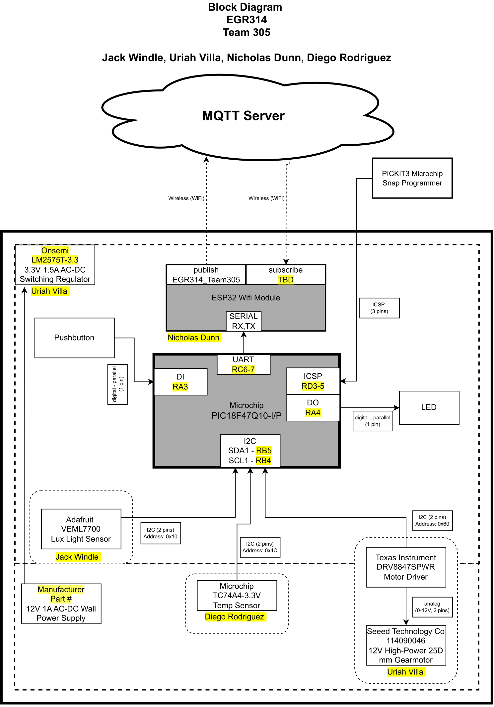

 
# Block Diagram

  After figuring out what project we would work on, the process of brainstorming the workflow of the circuit we were creating came. Figuring out what we would be using and listing how it would connect was the primary focus of this portion of the project, as well as determining who would be responsible for each subsystem. Aiming to create a complete block diagram would allow us to visually represent the circuit board in a clear and easy-to-understand form.

  In this process, we saw that course requirements determined we would use a Microcontroller to ESP32 communication to transmit data through WIFI. With this part selected by default, Nicholas was put in charge of getting the ESP32 to communicate with the microcontroller we selected and a Wi-Fi-enabled device, which, in our case, was a smartphone.
  
  Other components in our base requirements are two sensors and a motor controller. The motor controller, as its name implies, controls a motor through external data given through the central system of the group. Developed by Uriah, this subsystem relies on data fed to the design from the other two subsystem sensors. Uriah was the lead designer of the voltage regulator for the system and for the motor driver to be controlled through I2C.

  Diego and Jack would select their sensors for our remaining two components, with approval from the professor. Selecting a temperature sensor, Diego utilized a component we were familiar with to optimize time on the project. Focusing on our last sensor, Jack challenged himself with a light sensor. This component was challenging to wire and implement, thus leading to a unique project version. With Diego as the head of the temp sensor subsystem, he got the temp sensor to communicate with the microcontroller through I2C and was the lead in the code of the main project. With Jack as the lead designer of the light sensor subsystem and communicating through I2C to the microcontroller, he also became the co-lead in developing the main code for the project. 

   Later in the project, we split much of the work into different sections, with Uriah designing, building, and testing the team PCB that was milled and printed from JLPCB. Once the board was fully assembled and tested for wiring mistakes or shorts. Jack and Diego went through the debugging process with the software and checked that they could read the serial values received from the temp and light sensors. When our board was finished, and the code was ready, Nick was able to build the physical structure of the blinds, and Diego was able to 3D print the enclosure for the team board and sensors.

  In the above block diagram, we listed every part of our project, retroactively labeling each block with port information, part numbers, communication types, and additional information necessary for us to understand each segment. We also added more details about power, voltage regulation, and control buttons. This allows us to visualize the project from a fundamental view that most people can read and understand. Consolidating our unique subsystem information like this also allows us to view each other's subsystems and get knowledge of them without doing the initial research each member had to do.
  
* [Appendix D](/media/Block-Diagram.drawio.png)
  
