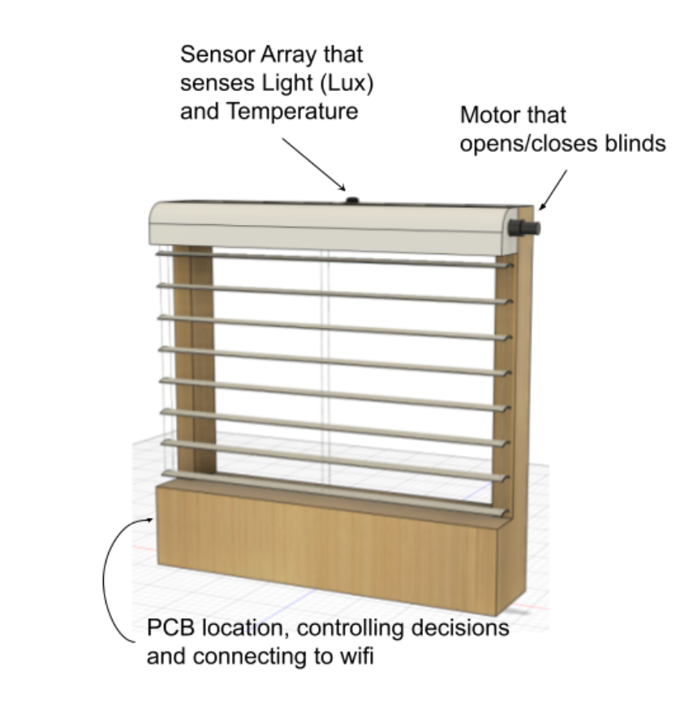
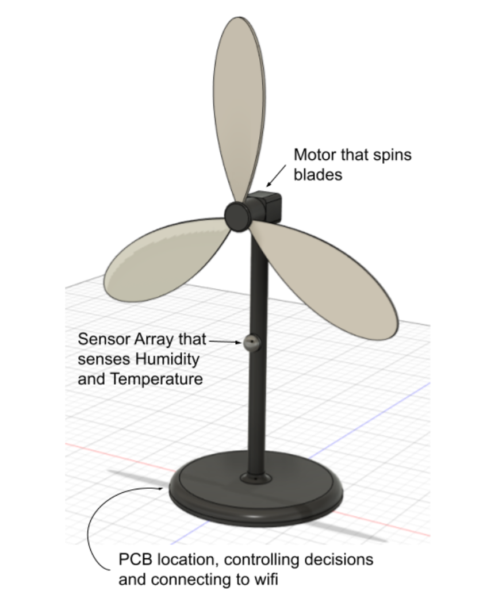
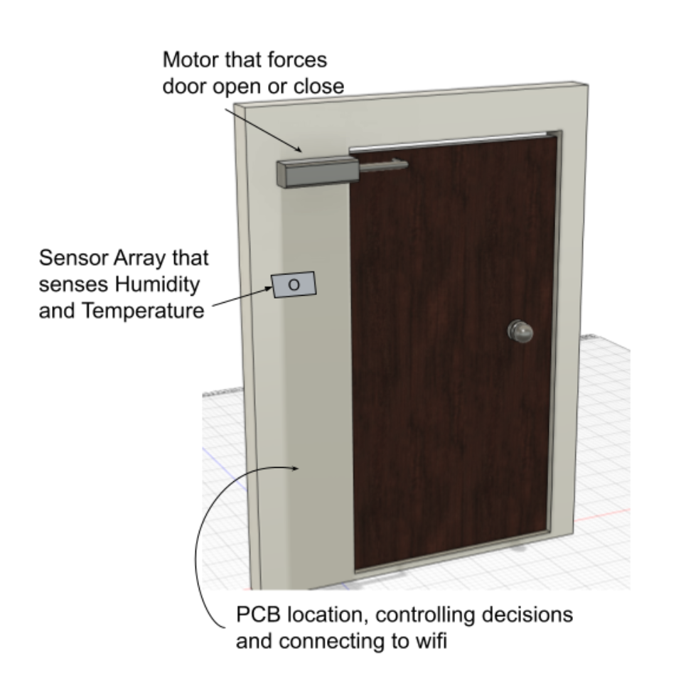

 
# Design Ideation and Final Design Selection

After we completed our user needs, we brainstormed any ideas we could think of that complied with our necessary measures. This landed us with three results. The first idea was a home automation system that would open and close blinds depending on the temperature and brightness in a room. The Second was a temperature and light-controlled fan, which would turn on when it was too hot or lights turned on. The third result we thought of was an automated door opener that senses when someone is near and will open the door. After much consideration, the Home Room Weather Control System made the most sense to us. This idea would be best since it needs the exact number of components and sensors to make it work for the requirements of this project, unlike the other ideas. 
  
This project would operate by reading the internal conditions of a room to control the blinds. If it is too bright, the light sensor will close the blinds using a motor controlled by the system. If it is too hot inside, it will close as well, and if the room is cold, then the blinds will open. The wireless control will allow the user to have complete remote control of the blind setting for their convenience. The blinds will have presets and a close/open increment button for simplicity. The blind settings will also have an automatic mode that can be set so the blinds will open and close to certain levels depending on the time of day and/or amount of light. The blinds and window will contain all the parts, requiring only a one-time setup process. Also, the unit will plug into standard US AC wall power, allowing it to be used anywhere an outlet is nearby. In summary, it is designed to control blinds intuitively.

  
   
  This chosen project allowed us to satisfy the project requirements. Next was a case of designing our subsystems and figuring out what parts we would use. This entailed creating a block diagram of how our subsystems would interact with each other and what components we would need to choose.

We went through a brainstorming phase to develop the product we are now working on. Our brainstorming for this project was brief since we unanimously agreed on the result. We began brainstorming ideas, and Jack thought we should do a home automation system that would utilize sensors to control house appliances and features. We, as a group, were instantly on board with this idea. 

# Automated Blinds

  
  
Home automation is a vast subject, so we devised three ideas to fit the topic. The first was a system using sensors to open or close blinds and read the sensors' values over the internet. The wireless control will allow the user to have complete remote control of the blind setting for their convenience. The blinds will have presets and a close/open increment button for simplicity. The blind settings will also have an automatic mode that can be set so the blinds will open and close to certain levels depending on the time of day and/or amount of light. The blinds and window will contain all the parts, requiring only a one-time setup process. Also, the unit will plug into standard US AC wall power, allowing it to be used anywhere an outlet is nearby.

 
 
 
 
 

# Automated Fan
  
  

The second system used sensors to turn on a fan/motor. This design allows the user to set a fan speed to best match their preference with presets they can choose or a faster/slower button for fine-tuning adjustment. The sensor array will allow the fan to tell if the temp or humidity is high and automatically turn on to create a draft that helps increase the room experience. The Wi-Fi control allows the user to control the fan remotely without needing the user to adjust the settings on this "smart fan."

# Automated Door
  
  
Lastly, the third idea was an automatic door using sensors to open or close. The door will automatically open wirelessly at the press of a button, helping those who might not otherwise be able to open the door physically. Examples include disabled users, those carrying many items, or those not wanting to touch the door. The door can also control the closing for the same reasons and to prevent slamming. The sensor array can have the door open/close to allow/prevent airflow through the rooms, even controlling the amount the door is "cracked" based on the temp/humidity. These settings can be preset or dynamically changed by the user.

 
 
 
 
 

After making mock CAD models and discussing all the ideas, we unanimously agreed that the automated blind opening system would be the best for our project because it is the most useful and efficient in everyday life. We then discussed the details to decide which sensors would make the most sense and our experience. After a brief discussion, we decided on this system functioning on the subsystems of a motor/motor controller, a light sensor, and a digital thermal sensor. 
